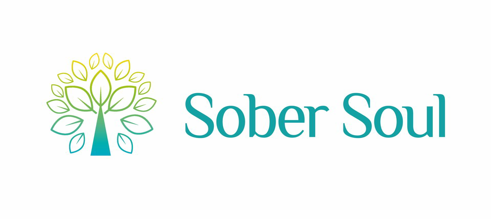
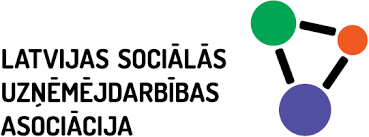

## Sabiedriskās aktivitātes

🔹līdzgaitniece [Valsts Probācijas dienestā](https://www.vpd.gov.lv/lv) (maijs, 2021-šobrīd)

🔹mentore riska grupas jaunietei biedrībā [Mentor Latvia](https://mentor.lv/) (aprīlis, 2021-šobrīd)

## Izglītība

🔹studijas doktora studiju programmā "Socioloģija" Rīgas Stradiņa universitātē (no 2021) 

🔹profesionālais maģistra grāds [valsts pārvaldē](https://drive.google.com/file/d/1i17aAyS8kfWV12pCmjRIeVRBS1iRo0mr/view?usp=sharing) (2017)

🔹profesionālais maģistra grāds [starpkultūru attiecībās](https://drive.google.com/file/d/1Hkr1PEl0q2Nd7d4b5-uOO8cM1X0vba3X/view?usp=sharing) (2013)

🔹bakalaura grāds [socioloģijā](https://drive.google.com/file/d/1lDruXppcwq72QqCL9n600dPGEeuAqHHy/view?usp=sharing) (2011)

## Kursi

🔹[Datu bāzes (projektēšana, vadība, datu atlase SQL)](https://www.rtu.lv/writable/public_files/RTU_datu_bazes_projektesana_vadiba_datu_atlase_sql_.pdf), 80 stundas (augusts-septembris, 2021, Rīgas Tehniskās Universitātes Tālākizglītības nodaļa)

🔹[Datu zinātne](https://drive.google.com/file/d/1DQS-eZEieHUnA99e_FdHJNrSYZDA0g-X/view?usp=sharing), 300 stundas (2021, Yandex Practicum)

🔹[Datu analītika](https://drive.google.com/file/d/1bFek9US4sUYHL0GJPBk4dqB_B7aL3yPn/view?usp=sharing), 240 stundas (2020, Yandex Practicum)

🔹[Holistiskais koučings](https://drive.google.com/file/d/19UKZyOxjpATDPK_fZ1G90LN79Q0Mrseh/view?usp=sharing), 172 stundas (2019, ICTA & New Reality) 

## Ar mani sadarbojas: 

 |  | ](Mentor.jpg)
-------|-----------------------------------|------------------
  

