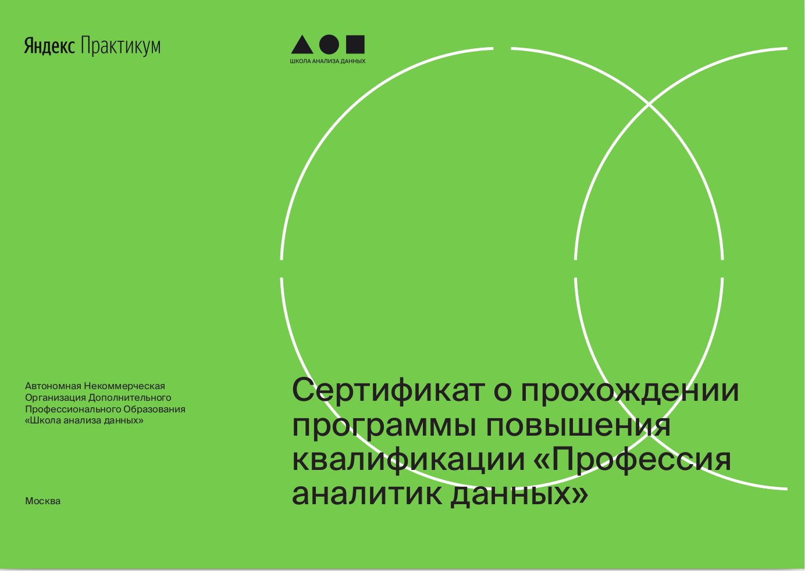
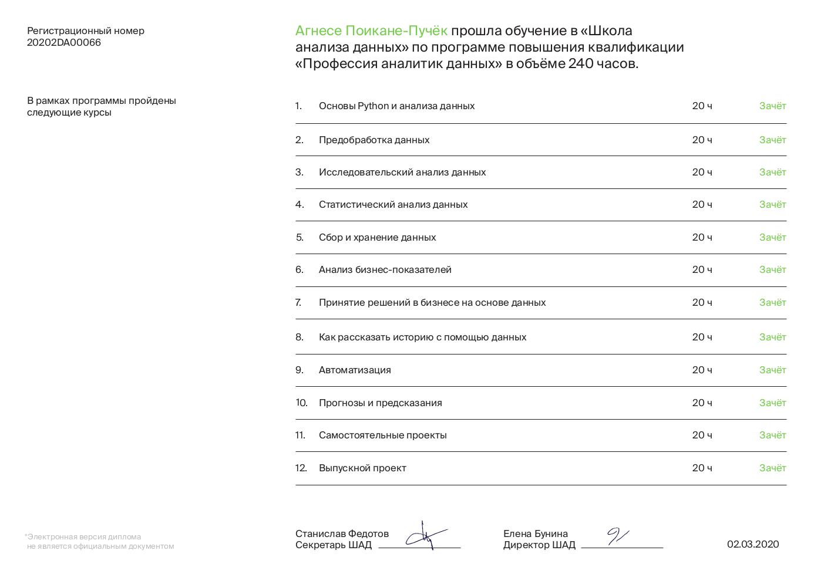

В марте 2020 года завершилась моя учёба на курсе [“Аналитик данных” от Яндекс.Практикум](https://praktikum.yandex.ru/) (далее - Практикум). В этой статье расскажу, что мне понравилось, а что, по моему скромному мнению, можно улучшить.

Я попала в третью когорту аналитиков. Обучение началось 22 августа 2019 года, а выпустились мы в начале марта 2020 года. Это важно отметить, так как продукт постоянно улучшается, а на май 2020 года выпустилась уже 5-я когорта аналитиков.

# Что хорошо знать до начала курса?

:small_blue_diamond: до начала платной части курса необходимо пройти бесплатную часть курса. 

:small_blue_diamond: обучение, особенно если вы новичок, может занять гораздо больше времени, чем указано в описание курса или спринтов. Я, конечно, не пример для подражание / сравнения, но вот вам мой личный кейс - бесплатная часть рассчитана на 20 часов, мне потребовалось 50+ часов.

:small_blue_diamond: c марта 2020 года появилась возможность помесячной оплаты (для аналитиков — 13 000 ₽ в месяц), но итоговая сумма [что логично] будет выше (для аналитиков — 78 000 ₽). Важно учесть факт, что оплата с вашей карточки будет списываться раз в месяц, а не за месяц обучения. Если будете брать академический отпуск, то будьте готовы оплатить и его.

:fire: Кстати, если вы готовы оплатить весь курс сразу и хотите **получить маленький, но приятный бонус**, напишите мне в [LinkedIn](https://www.linkedin.com/in/agnese-poikane-pucoka/) или в [Facebook](https://www.facebook.com/agnese.poikane/), я знаю кодовое слово и нужных людей!

*Источник: Яндекс.Практикум*

# Что мне понравилось:

✔️ удобный формат обучение, нескучная теория, классные иллюстрации и большое количество практических задачек в онлайн тренажёре.

✔️ как человек, который крайне плохо воспринимает информацию на слух, я особенно оценила, что теория подаётся в виде текста.

✔️ самостоятельные проекты. Порадовало, что данные и задачи в самостоятельных проектах были представлены из разных областей — из геймдева, сферы недвижимости, финансов, общепита и других. Таким образом, те студенты, которые сомневались, в какой области они хотели бы работать в дальнейшем, могли хоть на чуточку лучше понять, как могут выглядеть типичные задачи в той или иной области.

✔️ возможность из проектов Практикума оформить свой портфолио. Пригодится, если / когда будете искать работу на позицию аналитика.

✔️ регулярные встречи с наставниками в *Zoom*, во время которых разбирали наши ошибки, смотрели лучшие решение проектов, беседовали с опытными аналитиками, смотрели `live-coding` и делали многое, многое другое.

✔️ программа трудоустройства от Практикума и возможность принять участие в проектах от партнёров Практикума. Это ещё один крутой способ, как получить дополнительный опыт и пополнить портфолио с проектами, которые достаточно сильно отличаются от «классических проектов» Практикума.

Так я получила опыт работы с `.sav` файлом, который содержал 3138 столбцов, и пакетом `pyreadstat`. Не плохой опыт для джуна.

✔️ финальный проект — неожиданный и бомбический формат, который позволил на время выпускного спринта почувствовать себя в роли настоящего, самостоятельного аналитика.

✔️ дополнительные материалы в `Slack` (тут ими делились как наставники, так и сами студенты), рекомендации книг и большое количество ссылок в конце каждого спринта на другие ресурсы, которые могут пригодится для более глубокого понимания пройденного материала.

✔️ возможность давать регулярную обратную связь о продукте, коммуникации с командой, своём эмоциональном состояние и т.д.

✔️ люди Практикума (наставники, куратор, преподаватели, техническая поддержка и все-все-все, кто приложили руку к созданию данного проекта) — это какой-то космос! 💚 

Ребята крайне трепетно относятся к продукту, который создают, и это подкупает. Да и вообще они все там какие-то невероятные, умные, дружелюбные, лёгкие в общении и просто классные. Люблю всем сердцем.

✔️ студенты Практикума. Это не только все те классные ребята, с которыми вместе мы учились, но и ребята из предыдущих когорт и те, кто только думает поступать в Практикум и пишут личные сообщение с вопросами о жизни в Практикуме. Серьёзно, я ещё никогда за столь короткое время не знакомилась со столь большим количеством ребят из разных стран, с которыми у нас совпадают интересы. Это очень ценно.

# Что можно было бы улучшить:

🔺 предложить теорию не только в текстовом формате, но и в аудио / видео формате для тех, кто лучше учится слушая.

🔺 уменьшить нагрузку наставников [насколько я знаю, это уже делается и сейчас наставникам помогают код-ревьюеры], так как были ситуации, когда наставники просто не справлялись с проверкой проектов. Один из моих проектов проверяли 9 (!) дней. Но тут стоит отметить, что тот спринт — автоматизация — был сложен не только для большинства студентов, но и для наставников.

🔺 в самостоятельных проектах давать студентам больше той самой самостоятельности. Были случаи, когда самостоятельный проект почти полностью дублирует код из тренажёра. Один только вопрос — зачем тогда вот это вот всё?

🔺 улучшить / ужесточить часть курса по `SQL`. Там всё хорошо, логично, понятно, но на выходе знаний и практического опыта маловато, а навык написания `SQL` запросов - это один из ключевых навыков аналитика.

🔺 иногда бесил тренажёр, который сделан так, что принимает только один идеальный, образцовый способ решения задачи. А есть ситуации, когда один и тот же ответ можно получить разными способами и ты не знаешь какой из всех этих способов правильным считает автор задачки. Остаётся только перебирать все варианты, пока не найдёшь тот самый!

Было сложно, мне понравилось. 💚

Ссылка на упомянутый курс [тут](https://praktikum.yandex.ru/data-analyst "яндекс-практикум-аналитик-данных").
