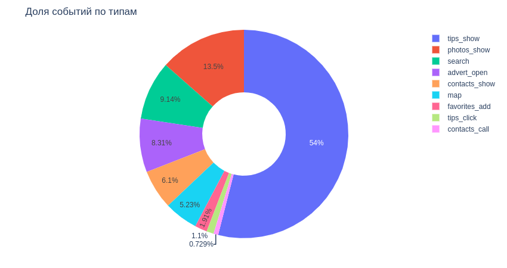
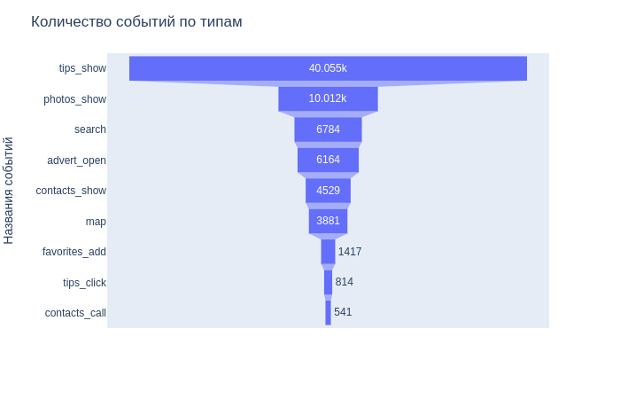
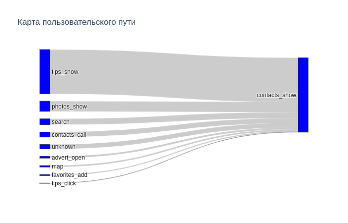
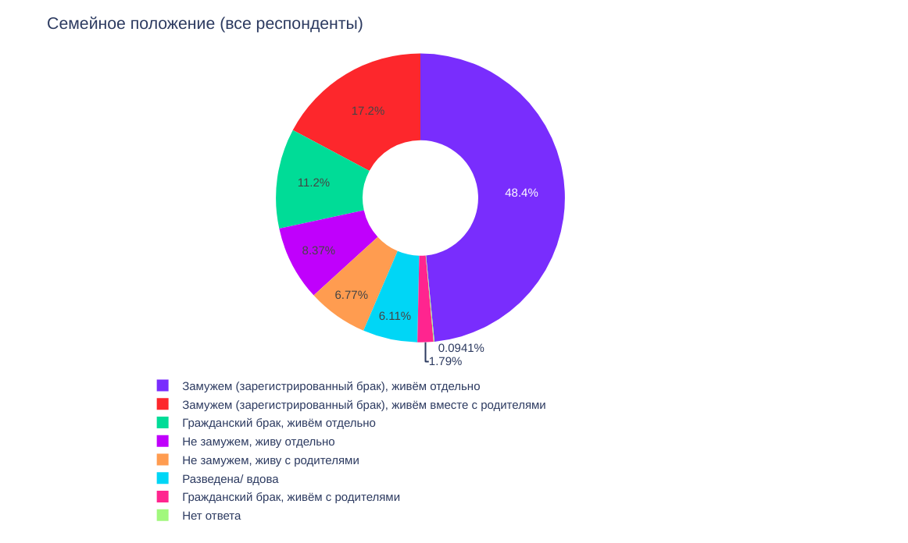
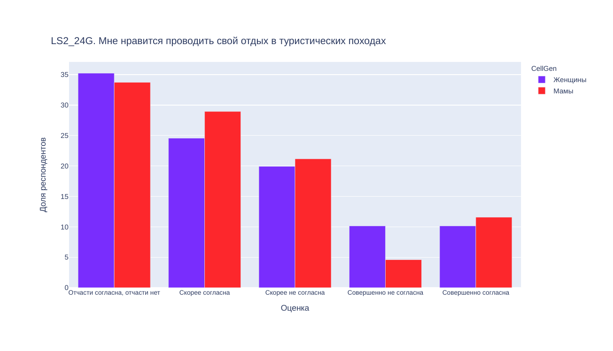
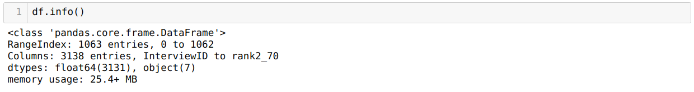
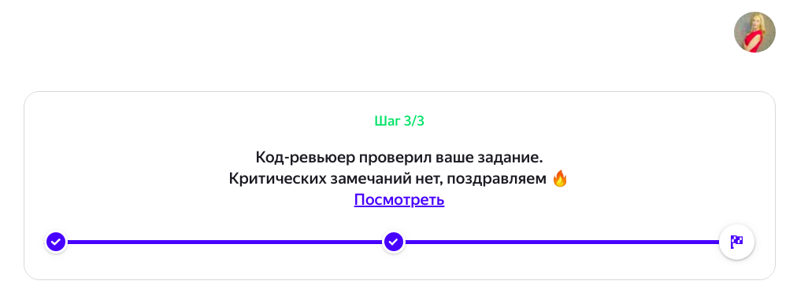
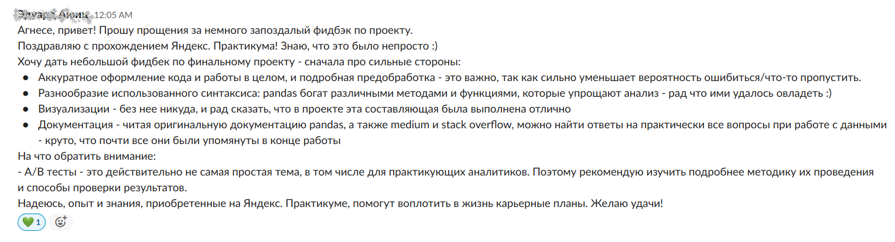
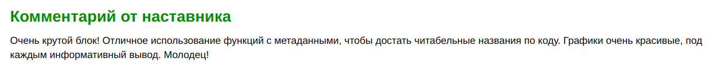
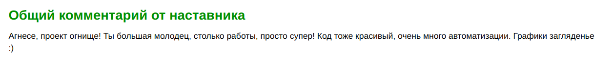

Ранее я уже писала о плюсах и минусах программы “Профессия аналитик данных” от [Яндекс.Практикум](https://praktikum.yandex.ru/) (далее - Практикум). Статью можно прочитать [тут](http://blog.agnesepoikane.com/2020/05/02/otziv-o-kurse-Analitik-dannih-ot-Yandex-Practicum/). 

Сегодня хочу затронуть тему самостоятельных проектов и рассказать, какие из проектов запомнились мне больше всего (по разным причинам).

*Источник: Яндекс.Практикум*

Стоит отметить, что за 6 месяцев обучения я сделала 15+ проектов из разных сфер: e-commerce, аналитика мобильных приложений, банки, телеком, геймдев, недвижимость и др.

# Самые любимые проекты

Учитывая мой интерес к таким сферам как социология и социальная психология, самыми интересными для меня оказались проекты, связанные с сегментацией пользователей, а также с изучением и анализом поведения пользователей в мобильных приложениях. 

Так совпало, что таких проектов было больше всего. Вот их описание (со странички [Практикума](https://praktikum.yandex.ru/data-analyst)):

🔹Необходимо сравнить, что и в каком режиме слушают жители Москвы и Петербурга, опираясь на данные Яндекс.Музыки.

🔹 У вас в распоряжении — лог с данными о посещениях сайта Яндекс.Афиши, выгрузка всех заказов, а еще статистика рекламных расходов. Вы изучите, как люди пользуются продуктом, когда они начинают покупать, сколько денег приносит каждый клиент, когда он окупается.

🔹 Вы работаете в стартапе, который продает продукты питания. Нужно разобраться, как ведут себя пользователи вашего мобильного приложения. Изучите воронку продаж и исследуйте результаты А/Б теста.

🔹 Вы работаете аналитиком в Яндекс.Дзене. Почти всё ваше время занимает анализ пользовательского взаимодействия с карточками статей. Подготовьте техническое задание и дашборд по нему вместе с менеджерами продукта.

Выпускной проект, который попался мне, также, был связан с сегментацией и анализом поведения пользователей, чему я была безумно рада! :)

*Источник: Яндекс.Практикум*

В каждом из проектов было интересно не только понять, *как* пользователи мобильного приложения перемещаются внутри приложении, но и попытаться понять, *почему* они это делают именно так. Ведь, для бизнеса важно понять, почему пользователи не доходят до оплаты сервиса, не переходят на следующий уровень игры (правда, этот пример из тестового, а не из проектов Практикума) или не возвращается в приложении в течение длительного срока. 

Кстати, именно во время этих проектов я поистине оценила удобство интерактивных графиков. Несколько ярких примеров: 

Пора разбавить ванильное настроение и перейти к проекту, который мне давался тяжелее всего. 

# Проект, который (почти) довел меня до слез

Привет, проект по статистическому анализу данных! 

*Источник: Яндекс.Практикум*

Описание проекта (со странички Практикума): 

*Вы аналитик компании «Мегалайн» — федерального оператора сотовой связи. Клиентам предлагают два тарифных плана: «Смарт» и «Ультра». Коммерческий департамент хочет понять, какой тариф приносит больше денег и скорректировать рекламный бюджет. Вам предстоит сделать предварительный анализ тарифов на небольшой выборке клиентов.*

Если большинство из моих проектов наставники принимали с первого раза, то этот проект я переделывала 4 (!) раза. 

Самое смешное, что со статистикой я дружила уже давно и по этой части вопросов не было. А вот выбор метрик и все эти `merge` и `pivot tables`… Комментарий от наставника:

Но я очень благодарна, что наставник очень терпеливо снова и снова возвращала проект на доработки, отвечала на мои вопросы в *Slack*, давала адекватную обратную связь и в общем делала все, чтобы помочь мне разобраться в теме. И когда я, наконец, раскусила логику объединения таблиц, было сложно понять, что, собственно, можно было там не понимать! :))

Далее расскажу о проекте, который сильно отличался от “классических” проектов Практикума. 

# Проект от партнеров Практикума

У студентов моей когорты была возможность поучаствовать в дополнительном проекте от партнера Практикума, и я с огромным интересом воспользовалась этой возможностью. 

Данные и техническое задание предоставила дизайн-студия. Наша задача была провести анализ данных и подготовить тренд-репорт о том, что сейчас в тренде, и что будет в тренде в следующем сезоне, опираясь на данные уже проведенного опроса. 

Вот тут то я и оторвалась по полной, ведь была возможность посмотреть на данные не только в разрезе групп (в проекте все респонденты были разделены на 2 группы - “мамы” и “женщины”), но и в зависимости от таких социально-демографических параметров как город, возраст, уровень дохода, тип занятости, семейное положение и тд.

Главное вовремя себя остановить, иначе, велика вероятность потерять фокус, сделать огромное исследование, но так и не ответить на вопрос бизнеса. 

Кстати, данные нам предоставили в виде `.sav` файла. В Практикуме мы в основном работали с `.csv` файлами. 

У меня есть опыт работы с `.sav` файлами в программе `SPSS` (привет, социологическое прошлое!), но в `Python` я с данным форматом файла работала впервые. Было интересно гуглить, читать форумы и документации, чтобы найти оптимальное решение для работы с таблицей, которая содержит больше чем 3000 столбцов. Ценный опыт! 

Еще на протяжении всего проекта у нас была возможность задавать вопросы заказчику, уточнить детали проекта, учиться адекватно реагировать на дополнительные требования заказчика и получить опыт работы в команде. А приятным бонусом в итоге проекта стала онлайн встреча с заказчиками, которые презентовали результат исследования.

В проектах Практикума, несмотря на то, что они максимально приближены к реальной жизни, такого живого общение не было. 

Далее немного расскажу о том, как проходит проверка проектов. 

# Проверка проектов

Каждый проект проходит проверку у наставника, т.е., опытного аналитика. Сейчас эту функцию выполняют project-ревьюеры, но суть та же. 

Все довольно просто: выполняешь и отправляешь проект на проверку (все это происходит внутри системы Практикума), и ждешь обратную связь.

Обычно проверка проекта занимает 24 часа, но, как вы можете догадаться, бывали и необычные ситуации. Тогда ответ можно было ждать по несколько дней (я уже говорила, что один из моих проектов проверяли 9 дней), но это скорее исключение из правил, нежели стандартная ситуация.

По каждому проекту мы получали индивидуальную обратную связь в виде комментариев к проекту. 

Комментарии бывали разные:

🔹 длинные

🔹 короткие

🔹 приятные

🔹 ну оооочень приятные

🔹 такие, где все шло хорошо, НО...

🔹 с рекомендациями

🔹 с подсказками

🔹 ...

Очень понравился такой индивидуальный подход. К тому же, большим плюсом считаю возможность поработать с разными наставниками, так как у каждого из них свой подход к оценке проекта. Кто-то “топил” за качественную визуализацию, кто-то за подробные выводы, а еще кто-то за оптимизацию кода. Это очень помогает выводить проекты на новый уровень!

На этом сегодня все - кто прочитал до конца, тот молодец и может забрать бонус! :)

# Бонус

Если тоже хочешь пройти какой-нибудь из курсов Практикума, напиши мне - я знаю кодовое слово, которое дает 7% скидку при полной оплате курса (суммируется со скидкой Яндекс.Плюс, которая дает 5% скидку). 

