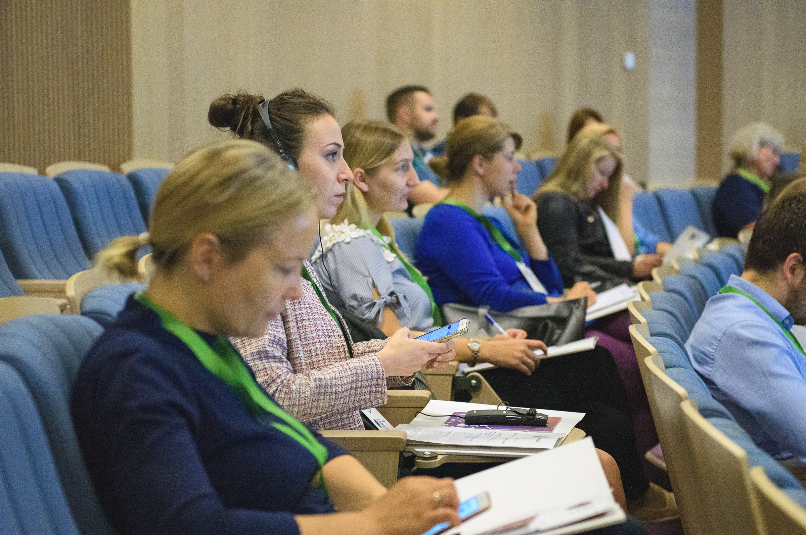
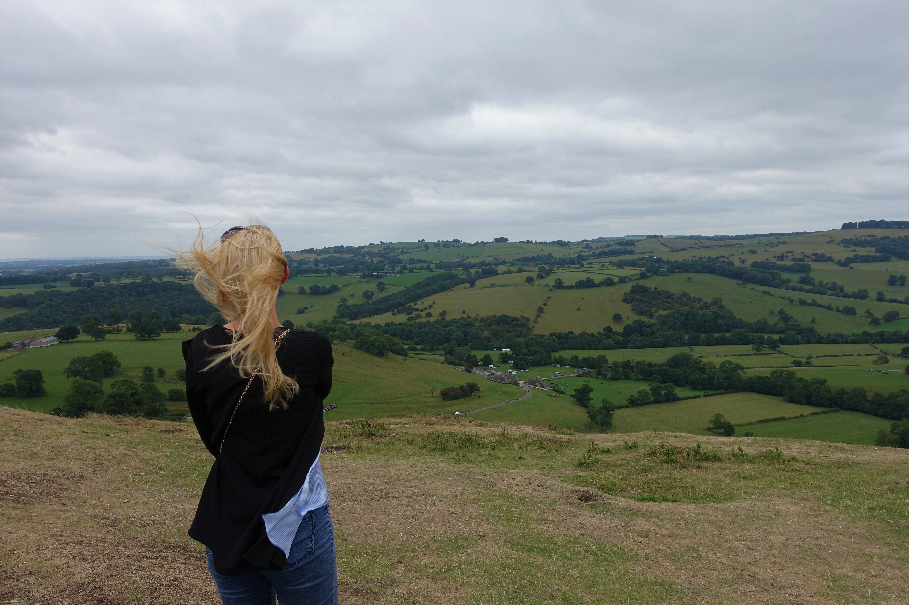

Продолжаю серию статей, в которых рассказываю про свой опыт обучения на программе [«Аналитик данных»](https://praktikum.yandex.ru/data-analyst) от Яндекс.Практикум (далее - Практикум). 

Сегодня расскажу, почему выбрала аналитику данных, чем занималась до Практикума и куда планирую развиваться в будущем. 

# Что было ДО Практикума

Раньше я профессионально развивалась в сфере межкультурных отношений, работала в центрах национальных меньшинств и строила карьеру на государственной службе, за которую получала грамоты от Посла и Министра иностранных дел, а в свободное время занималась волонтерством (от социализации собак из приютов до проектов Европейской волонтерской службы). 

А еще я хорошо училась, получала стипендию и, время от времени, могла себе позволить не работать, а заниматься исключительно учебой и волонтерской деятельностью.

*Фото: из личного архива. Public Administration (2017, магистр), Intercultural Relations (2011, магистр) и Социология (2008, бакалавр).*

Следует признать, что, вопреки всем внешним атрибутам успеха, в то время я плохо понимала свои потребности и очень часто выбирала работу, которая не совсем соответствует моему характеру. Например, несмотря на интровертность, я часто соглашалась на должности, которые подразумевали активное взаимодействие с людьми. 

Я выступала с презентациями, организовывала различные мероприятия, встречалась с клиентами и много, много общалась… И долгое время я даже не замечала, что после работы я часто была эмоционально опустошена, избегала разговоров с близкими и просто ждала, когда, наконец, услышу т и ш и н у.

В итоге, спустя несколько лет, я выгорела и взяла `gap year` — год, свободный от работы и учебы. Цель была ясна: отдохнуть, оградить себя от чужих мнений и понять, кто я есть в профессиональном плане, если не *[event-office-client]* менеджер.

Тут мог бы быть текст о том, как за год я объездила полмира, но реальность была такова, что большую часть времени я провела в квартире в Минске, посещала массу мероприятий по личностному росту и бесконечно копалась в себе.

*Фото: Международный центр обучения и развития "Вектор Роста". Практик эннеаграммы (2018) и бесконечные тренинги по личностному росту.*

Была, конечно, и поездка на Бали, йога и смузи-вечеринки, но красоту инстаграмной жизни очень скоро сменила реальность и мрачные периоды самобичевания. Скажу одно: никто никогда на меня не выливал столько грязи, как я сама за эти дни, недели и месяцы. 

Я миллион раз задавала себе вопрос: «Ага, что ты любишь делать больше всего?» и миллион раз на бумаге выписывала все те занятия, которые приносят мне радость. Помимо таких активностей как «читать книги», «узнавать новое», «путешествовать» и «принимать вызовы», там всегда были фразы «изучать поведение людей» и «собирать и обрабатывать информацию». 

Помню, как вскоре я начала озвучивать эти фразы мужу каждый раз, когда заходил разговор о будущем. Иногда это звучало как мантра или заклинание: «Я люблю изучать поведение людей. Я люблю собирать и обрабатывать информацию. Я люблю анализировать данные.» И так по несколько итераций каждый день. 

Сейчас я понимаю, что эти слова я говорила себе, а не мужу, и таким образом настраивалась на новую реальность, где я уже не менеджер, а начинающий профессионал по анализу данных. 

*Фото: из личного архива. Латвия, 2018.*

Правда, название профессии пришло позже, после того, как я обработала огромное количество информации и выписала все профессии, которые так или иначе были связаны с моими интересами. А дальше магия рекомендательных систем стала назойливо предлагать информацию о курсах по анализу данных и `Data Science`. И я поддалась давлению! 

Выбор пал на курс от Практикума, так как я была уверена, что такая компания как Яндекс не станет рисковать именем бренда и не будет выпускать плохой продукт на рынок. С выбором курса я действительно не прогадала! Правда, не помню, почему выбрала курс на русском языке, но, видимо, сейчас это уже и не важно. :)

***

Тут случился Практикум. 
О плюсах и минусах программы, по моему скромному мнению, можно узнать тут. А тут можно почитать о том, какие из самостоятельных проектов Практикума запомнились мне больше всего. 

***

# Жизнь ПОСЛЕ Практикума

С момента выпускного прошло уже почти полгода, но серьезными поисками работы я все еще не занялась. А случилось это по двум причинам:

- первая: когда на протяжении нескольких месяцев ты в живую общаешься только с мужем, собакой и психотерапевтом, сложно заставить себя вновь окунуться в мир социальных контактов! :)) 

Тут, также, можно упомянуть синдром самозванца, синдром отличника и любой другой синдром, который говорит о неуверенности в себе, высоких ожиданиях к себе и о том, что тебе очень важен результат твоей работы.

*Фото: Vlada Karpovich from Pexels*

Дома, работая над своими проектами, я могла часами биться над алгоритмической задачей, искать лучшую реализацию для своей идеи, а в бизнесе, ведь, все по-другому — там деньги, сроки и ответственность.

И пугает не сложность задач или ответственность перед бизнесом, а именно сроки, ведь мне для решения какой-либо задачи пока может потребоваться гораздо больше времени, чем опытным коллегам или даже другим джунам.

- вторая: несмотря на то, что Практикум дал возможность попробовать себя в роли аналитика в разных областях, я долгое время так и не смогла понять, куда хочу двигаться дальше. 

Да, во время Практикума, я четко осознала, что мне безумно интересны проекты, связанные с анализом поведения пользователей в мобильных приложениях, и я даже прошла парочку собеседований в компаниях по разработке игр, так как считаю, что там одни из самых интересных данных. 

Но проблема в том, что сама индустрия игр, если это не развивающие и обучающие игры, мне не интересна. Я уверена, что без интереса к продукту у меня попросту не будет мотивации расти самой и искать точки роста для бизнеса.

И только тогда, когда я перестала уговаривать себя откликаться на каждую более менее интересную вакансию, ко мне пришло понимание, что мне по-настоящему интересны проекты, которые: 

- связаны с анализом поведения пользователей в образовательных и обучающих приложениях
- связаны с анализом данных для социальных предприятий, этичных брендов и предприятий с высокой корпоративной социальной ответственностью
- направлены на решение социальных проблем 

*Фото: Ассоциация социального предпринимательства. Форум социального предпринимательства в Латвии (2019).*

За время раздумий, я включилась в жизнь сообщества Практикума, поучаствовала в создании Библиотеки аналитика, попробовала себя в роли бета-тестера обновленных курсов Практикума, а также погрузилась в свои проекты:

- анализ и визуализация расходов нашей семьи
- парсинг постов с моего Wordpress блога для загрузки в мой профиль на `Goodreads` 
- работа с `NoSQL` и анализ объявлений о продаже б/у автомобилей
и еще множество начатых, но пока не завершенных проектов, связанных с анализом данных о серийных убийцах и преступлениях

Смотрю на перечисленные проекты и понимаю, что Практикум дал мне не только хорошую базу знаний, но и научил меня думать шире и не бояться хотя бы попробовать решить задачи, которые изначально могут казаться неподъемными.

*Фото: из личного архива. Великобритания, 2018.*

Так, например, я сейчас развиваю идею написать удобный сервис для обмена сообщениями о пропавших, найденных или брошенных собак, чтобы потеряшки быстрее вернулись домой, а брошенные собаки — приобрели новый дом. 

# Итог

В итоге могу сказать, что, несмотря на все свои страхи и стресс перед каждым собеседованием, я буду искать работу, связанную с анализом данных. Только мне уже не так важно, как будет называться моя новая должность — аналитик данных, социолог, исследователь или консультант. Для меня важно только то, что я хочу:

- изучать поведение людей
- собирать и обрабатывать информацию
- анализировать данные
- приносить социальную пользу

И я верю, что впереди меня ждет очень много данных (`Big Data`, я до тебя еще доберусь!) и много интересных инсайтов, а черная полоса, о которой я сегодня рассказала, окажется взлетной… 🖤

